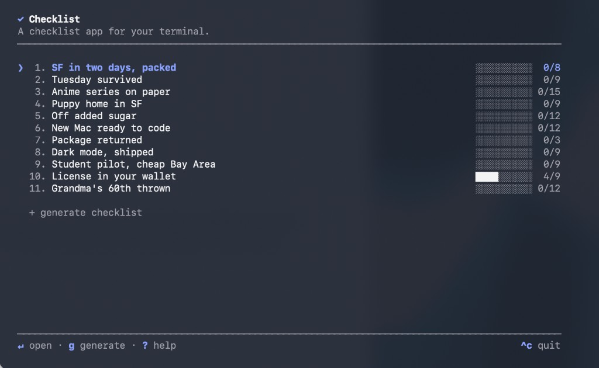

# checklist-tui

turn a goal into an actionable checklist. check it off. get it done. All in your terminal.



## Install

```sh
npm install -g checklist-tui
```

## Usage

```sh
$ checklist                              # open your saved checklists
$ checklist "plan grandma's birthday"    # generate one immediately
$ checklist update                       # install the latest version
$ checklist uninstall                    # remove the app
```

Checklist takes over the terminal and restores it when you quit. Use ↑/↓ to
move, enter to open, and space to check off a task. Press `g` to generate,
`n` to create one yourself, `?` for every shortcut, and `^c` to quit.

Your checklists are saved locally and stay on your machine.

Goals are sent to the generation service only when you generate a checklist.
No account or API key is required.

## Development

```sh
npm install
npm run dev
npm run build
npm run typecheck
```

To try the command globally without publishing, run `npm link`, then use
`checklist` from any folder.

## License

Source is public so you can read it. Not licensed for reuse.
